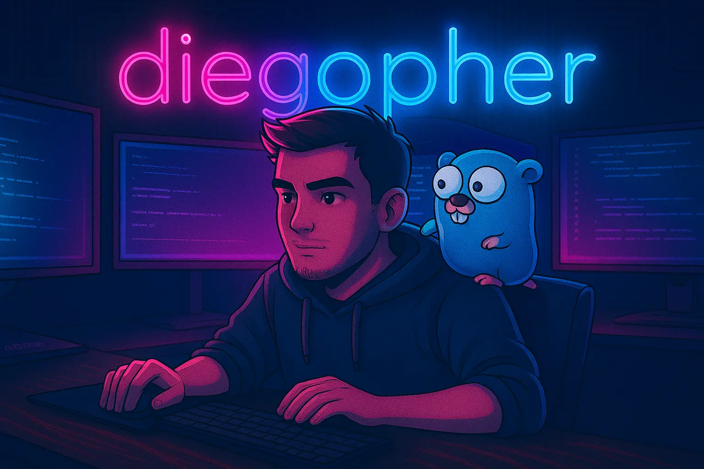

# Hey there! 👋

## About Me

Full-stack developer with a strong backend focus, passionate about building robust, scalable applications. I enjoy the logical aspects of development, always look for ways to improve the code I work with, and love customizing Linux environments. 

## 🛠️ Tech Stack

### Languages

  
  
  

### Frontend

  
  
  
  
  

### Backend

  
  
  

### Tools & Technologies

  
  
  
  
  

## 🎯 Current Focus

- 🔭 Expanding knowledge in **DevOps** and **Cloud Technologies**
- 🌱 Learning about containerization, orchestration, and CI/CD pipelines
- 🚀 Building scalable backend architectures
- 🤖 Exploring automation tools and practices
